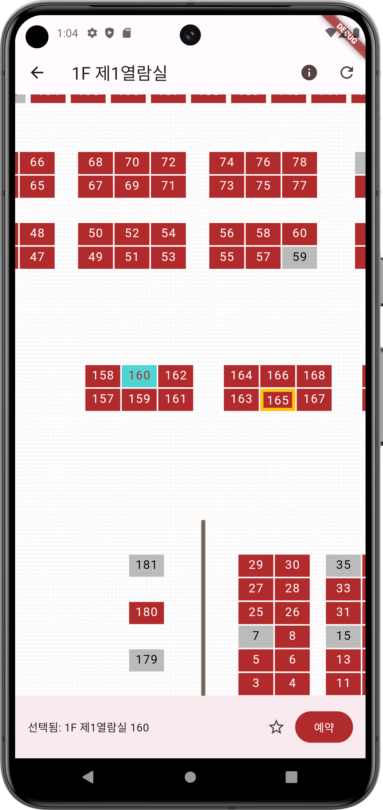
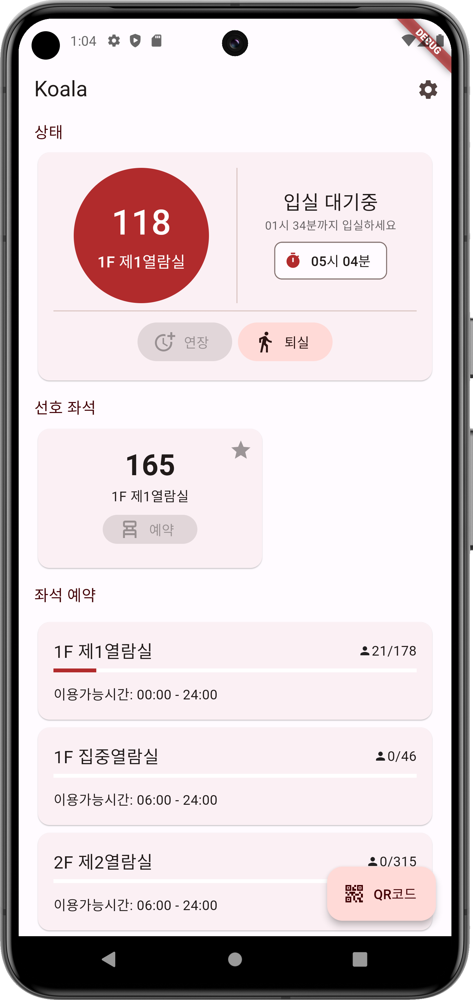

> ⚠️ 주의사항: 이 앱은 경희대학교 도서관 시스템의 비공식 클라이언트입니다. 이 프로그램의 사용에 대한 책임은 전적으로 사용자에게 있습니다. 이 앱의 개발자는 경희대학교와 관련이 없으며 이 앱의 사용으로 인해 발생할 수 있는 어떠한 결과에 대해서도 책임을 지지 않습니다.

# koala

> Kyunghee University's Opensource App for Library Access

Koala는 경희대학교 도서관 예약/출입 시스템의 비공식 클라이언트입니다. Koala를 통해 좌석을 예약/연장/사용 종료 할 수 있고, QR 코드를 사용해 출입이 가능합니다.

 
Koala는 오픈소스 프로젝트로, 누구든지 코드를 확인하고 수정/추가를 제안 할 수 있습니다.

## (간단한) 작동 구조

Koala는 기본적으로 경희대학교 도서관 웹사이트의 대체 프론트엔드입니다. 기존의 공식 웹 인터페이스와 유사한 방식으로 일련의 HTTP 요청을 통해 도서관 백엔드 서비스와 통신합니다. 이를 통해 Koala는 기존 도서관 인프라를 활용하면서도 WebView보다 더 나은 모바일 앱 경험을 제공합니다.
Koala가 도서관 서비스와 어떻게 상호작용하는지 자세히 알아보기 위해 로그인 프로세스를 살펴보겠습니다:

1. 암호화 키 가져오기:
- 도서관 시스템에 로그인 할 때에는 먼저 프런트엔드 단에서 사용자 Credential을 주어진 Key로 암호화 해야합니다.
- Koala는 먼저 도서관 서버(/login)에 GET 요청을 보내 암호화 키를 가져옵니다.
 
2. 로그인 요청:
- 암호화 키를 받으면 Koala는 해당 키를 사용하여 사용자의 로그인 자격 증명을 fast_rsa 패키지를 사용해 암호화합니다.
- 암호화된 자격 증명과 함께 POST 요청이 도서관 서버로 전송되어 사용자를 인증합니다.
- 자격 증명이 유효하면 서버는 로그인 세션 토큰으로 응답합니다.
 
3. 좌석 예약 시스템 로그인:
- 이전 단계에서 받은 로그인 세션 토큰을 사용하여 Koala는 libseat.khu.ac.kr에서 좌석 예약 시스템에 로그인하기 위해 또 다른 요청을 보냅니다.
- 이 단계는 좌석 예약 기능에 접근하고 도서관 입장을 위한 사용자의 QR 코드를 가져오는 데 필요합니다.

4. QR 코드 세션 ID 가져오기:
- 좌석 예약 시스템에 성공적으로 로그인한 후, Koala는 사용자의 세션 정보를 가져오기 위해 GET 요청을 보냅니다.
- 서버의 응답은 사용자의 QR 코드와 연결된 고유 식별자인 QR 코드 세션 ID를 추출하기 위해 파싱됩니다.

5. QR 코드 가져오기:
- QR 코드 세션 ID를 사용하여 Koala는 실제 QR 코드 문자열을 가져오기 위해 최종 요청을 보냅니다.
- QR 코드 문자열은 처리되어 Koala 앱 내에서 사용자에게 표시되며, 도서관 입장 시 스캔할 수 있습니다.

공식 앱이 token 기반 로그인을 사용하는 것과 달리, Koala는 아이디/비밀번호를 저장해둔 후 로그인이 필요할 때 사용하는 방식으로 자동 로그인을 구현합니다. 이는 기술적으로 크롬, 파이어폭스 등의 웹 브라우저의 비밀번호 저장 기능과 차이가 없습니다. Koala는 Hive 패키지의 encrypted box 기능과 flutter_secure_storage 패키지를 사용해 유저 정보를 암호화 후 저장합니다. 설정 정보를 제외한 그 어떤 정보도 평문으로 저장되지 않고, 도서관 서버를 포함해 그 어떤 외부 서버에도 평문으로 전송되지 않습니다.

## Features

공식 어플리케이션은 기존의 웹페이지를 모바일 어플리케이션으로 포장한 Webview기반의 어플리케이션입니다. 정확한 작동 방식은 확인하기 어렵지만, 로그인 세션, NFC 기능 등 몇가지 기능을 제외하면 웹페이지와 동일하게 작동합니다.

대부분의 유저가 좌석 예약, QR코드 등 간단한 태스크만을 이용하는 반면, 공식 앱은 불필요한 이미지 등의 requests를 만들게되고, 결과적으로 앱이 반응적이지 않고 불필요하게 모바일 데이터를 사용하게됩니다.

Koala는 로그인과 좌석 이용 등에 필요한 최소한의 requests만을 만들고, 주로 사용되는 태스크에 집중하였습니다. 또한, 기존 앱에서 제공하지 않는 몇가지 기능을 추가하였습니다. Koala의 주요 기능/특징은 다음과 같습니다:

- 좌석 예약/연장/반납 & 이동 (기존 좌석을 반납 후 바로 새로운 좌석을 예약합니다)
- 선호 좌석 설정
- 출입 QR코드 렌더링
- 좌석 사용 만료 전 알람
- Flutter & Material Design을 사용한 유저 친화적인 UI/UX

  
Screenshots

  ### Login
  

  ### Main page
  

  ### QR Code
  

  ### Seats page
  

  ### Main page in use
  

## 알려진 이슈

> ⚠️ Koala는 현재 초기 베타 버전으로, 상당한 변경이 있을 수 있습니다. 아래 나열되지 않은 문제가 발생하면 GitHub에 이슈를 생성해 주시기 바랍니다. 

- 운영시간 종료 직전 연장/예약 로직이 제대로 테스트되지 않았습니다.

## 업데이트/기능 추가 관련 사항

iOS는 테스트가 불가능하고 임의 설치가 불가능해 지원하지 않습니다. Flutter이기 때문에 직접 빌드해 설치하셔도 되지만, 버그 수정 등은 어렵습니다. (local_notifications 설정이 되어있지 않아 수정없이 사용이 어려울 수 있습니다.)

또한 다음과같은 사항들도 지원하지 않거나 제한된 지원만을 제공할 것입니다

- 웹/윈도우/macOS/GNULinux 클라이언트
- 빠른 주기의 업데이트/버그 수정
- 좌석 예약/출입 이외의 기능 추가
- 구글 플레이스토어 배포 (규정들이 많고 테스트 계정을 제공하기 어려워 지원 할 수 없습니다)

## License & Disclaimer

This project is licensed under the MPL License - see the [LICENSE.md](LICENSE.md) file for details. 

This software is provided "AS IS", without warranty of any kind, express or implied, including but not limited to the warranties of merchantability, fitness for a particular purpose, and noninfringement. In no event shall the authors or copyright holders be liable for any claim, damages, or other liability, whether in an action of contract, tort, or otherwise, arising from, out of, or in connection with the software or the use or other dealings in the software.
