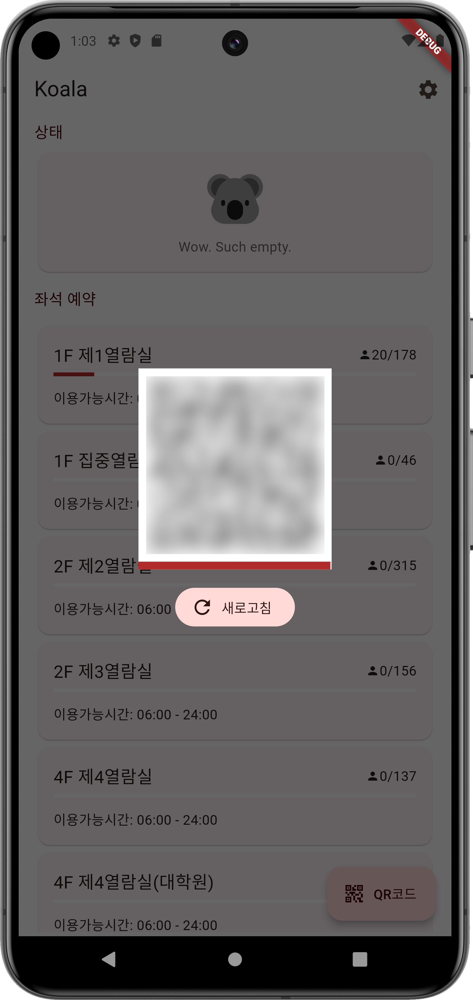

> ⚠️ Please note, this app is an unofficial client to the library system for Kyunghee University. You are solely responsible for the usage of this program. The developer of this app are not affiliated with Kyunghee University and bear no responsibility for any consequences that may arise from your use of this app.

# koala

> Kyunghee University's Opensource App for Library Access

An **unofficial** client to the library system for Kyunghee University. You can use QR code to get into the library or reserve and leave your seats with far less requests than the official app(if it even works in the first place..)

Your data never leaves your phone except for the library's server.

## How does this work?
Koala is essentially an alternate front-end to the library website. Here's an example of how logging in works:
- A GET request is made to fetch an encryption key, which is used to encrypt your credentials before making a POST request.
- A POST request is then made to actually log in.
- You log in again at libseat.khu.ac.kr using the login session obtained earlier.
- Another GET request is made, and the response is parsed to obtain the QRCode session ID.
- Actual QRCode string is retrieved.

This process is rather complicated, and many of the requests seem redundant. But thinking that the official app(which seems to be a plain webview wrapper with some extra token stuff) makes bazillion requests everytime I do something, this app makes significantly less requests, which is less taxing for both library server and your device.

One of the problem to this implementation is that saving plaintext credentials is inevitable to achieve auto-login. Session expires without clear rule and it's going to be more frustrating to log in to 3rd party app periodically than to just log in to the website itself.

Koala securely stores your plaintext credentials in Hive's encrypted box, with the encryption key safely stored in the secure_storage. This doesn't mean that you are going to be safe from any exploits so consider using different passwords for every website you use(you can use something like Keepass or Bitwarden).

## Features

- Check, reserve, leave and extend (coming soon!) your seat with our no-nonsense Flutter app, designed for simplicity and efficiency.
- Save time and resources with Koala's optimized functionality, requiring only 10-15 requests compared to the official webpage's 200+ requests just to log in.
- Quickly access your entrance QR code.

  
Screenshots

  ### Login
  

  ### Main page
  

  ### Seats page
  

## Known Issues

> ⚠️ Please note that Koala is currently in early beta and may undergo significant changes. If you encounter any issues not listed below, please open an issue on our GitHub repository.

> ℹ️ Most issues can be resolved by simply restarting the app.

- Seat extension feature is not yet implemented (fix coming soon!).
- Some widgets may experience glitches, such as the timer not starting or occasional errors.

## About Future Updates & iOS support
Koala will never officially support iOS, only because I don't use it. Since Koala is written in Flutter, you are welcome to build it yourself and publish it on App store. However, even if it happens, it will never be officially supported and bug reports should be made to the publisher not me.

Koala will also have limited or no support for these:

- Web/Windows/macOS/Linux client (Linux client works but still it won't be supported or built)
- Constant update / bug fix
- New features (anything not related to seats is out of scope)
- Play Store (I will not )

## License & Disclaimer

This project is licensed under the MPL License - see the [LICENSE.md](LICENSE.md) file for details. 

This software is provided "AS IS", without warranty of any kind, express or implied, including but not limited to the warranties of merchantability, fitness for a particular purpose, and noninfringement. In no event shall the authors or copyright holders be liable for any claim, damages, or other liability, whether in an action of contract, tort, or otherwise, arising from, out of, or in connection with the software or the use or other dealings in the software.
